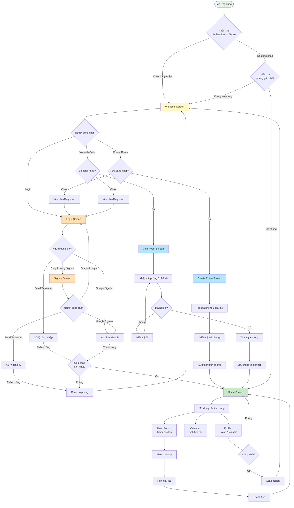

# User Flow - Panda Study Buddy

## Mục lục
1. [Tổng quan](#tổng-quan)
2. [Danh sách màn hình](#danh-sách-màn-hình)
3. [Sơ đồ luồng người dùng](#sơ-đồ-luồng-người-dùng)
4. [Chi tiết luồng](#chi-tiết-luồng)
5. [Logic xác thực và phòng học](#logic-xác-thực-và-phòng-học)

---

## Tổng quan

Tài liệu này mô tả luồng điều hướng người dùng (user flow) trong ứng dụng **Panda Study Buddy** - một ứng dụng học tập cùng bạn bè với mascot gấu trúc dễ thương.

### Đặc điểm chính của luồng:
- **Xác thực linh hoạt**: Hỗ trợ đăng nhập bằng email/password và Google Sign-In
- **Quản lý phòng học**: Người dùng có thể tạo phòng mới hoặc tham gia phòng bằng mã
- **Điều hướng thông minh**: Tự động điều hướng dựa trên trạng thái đăng nhập và phòng học
- **Session persistence**: Lưu trạng thái người dùng và tự động đăng nhập lại

---

## Danh sách màn hình

### 1. Màn hình Welcome (`welcome_screen.dart`)
- **Mô tả**: Màn hình đầu tiên khi mở app
- **Chức năng**: 
  - Hiển thị branding và giới thiệu app
  - Nút "Create Study Room"
  - Nút "Join with Code"
  - Link đến màn hình Login

### 2. Màn hình Login (`auth/login_screen.dart`)
- **Mô tả**: Màn hình đăng nhập
- **Chức năng**:
  - Đăng nhập bằng email/password
  - Đăng nhập bằng Google
  - Link đến màn hình Signup
  - Quên mật khẩu (TODO)

### 3. Màn hình Signup (`auth/signup_screen.dart`)
- **Mô tả**: Màn hình đăng ký tài khoản mới
- **Chức năng**:
  - Tạo tài khoản mới với email/password
  - Đăng ký bằng Google
  - Link quay về màn hình Login

### 4. Màn hình Create Room (`room/create_room_screen.dart`)
- **Mô tả**: Tạo phòng học mới
- **Chức năng**:
  - Tạo mã phòng 6 chữ số ngẫu nhiên
  - Hiển thị mã phòng để chia sẻ
  - Điều hướng đến Home Screen

### 5. Màn hình Join Room (`room/join_room_screen.dart`)
- **Mô tả**: Tham gia phòng bằng mã
- **Chức năng**:
  - Nhập mã phòng 6 chữ số
  - Xác nhận và tham gia phòng
  - Điều hướng đến Home Screen

### 6. Màn hình Home (`home/home_screen.dart`)
- **Mô tả**: Màn hình chính của app với bottom navigation
- **Chức năng**:
  - Tab 1: Deep Focus Screen (màn hình học tập chính)
  - Tab 2: Calendar Screen (lịch học)
  - Tab 3: Profile Screen (hồ sơ người dùng)

### 7. Các màn hình phụ
- **Deep Focus Screen** (`home/deep_focus_screen.dart`): Màn hình timer học tập
- **Break Screen** (`home/break_screen.dart`): Màn hình nghỉ giải lao
- **Success Screen** (`home/success_screen.dart`): Màn hình thành tích
- **Calendar Screen** (`calendar/calendar_screen.dart`): Lịch học tập
- **Profile Screen** (`profile/profile_screen.dart`): Hồ sơ và cài đặt
- **Recap Screen** (`recap/recap_screen.dart`): Tổng kết học tập

---

## Sơ đồ luồng người dùng



---

## Chi tiết luồng

### A. Luồng khởi động ứng dụng (Initial Launch)

#### Lần mở đầu tiên hoặc chưa đăng nhập:
1. **Khởi động app** → `main.dart` khởi tạo Firebase và Hive
2. **Kiểm tra authentication** → `AuthProvider` kiểm tra Firebase Auth token
3. **Không tìm thấy token** → Hiển thị `WelcomeScreen`
4. Người dùng thấy các option:
   - "Create Study Room"
   - "Join with Code"
   - Link "Log In" ở cuối màn hình

#### Lần mở tiếp theo (đã đăng nhập và có phòng):
1. **Khởi động app** → Kiểm tra authentication
2. **Token hợp lệ** → Tự động đăng nhập
3. **Kiểm tra phòng gần nhất** → Có dữ liệu `roomCode` trong user
4. **Vào thẳng HomeScreen** → Bỏ qua Welcome và Room selection

#### Lần mở tiếp theo (đã đăng nhập nhưng chưa có phòng):
1. **Khởi động app** → Kiểm tra authentication
2. **Token hợp lệ** → Tự động đăng nhập
3. **Kiểm tra phòng gần nhất** → Không có `roomCode`
4. **Hiển thị WelcomeScreen** → Để tạo/tham gia phòng

---

### B. Luồng đăng nhập (Authentication Flow)

#### B1. Đăng nhập bằng Email/Password:
```
WelcomeScreen → LoginScreen
  ↓
Nhập email + password
  ↓
AuthProvider.signInWithEmailPassword()
  ↓
Firebase Authentication
  ↓
[Thành công] → Lưu user vào Firestore
  ↓
Kiểm tra có roomCode?
  ├─ Có → HomeScreen
  └─ Không → WelcomeScreen (để tạo/join room)
```

#### B2. Đăng nhập bằng Google:
```
WelcomeScreen → LoginScreen → Tap "Login with Google"
  ↓
GoogleSignIn() trigger
  ↓
User chọn tài khoản Google
  ↓
Lấy credential (accessToken + idToken)
  ↓
Firebase.signInWithCredential()
  ↓
AuthStateListener tự động sync user
  ↓
[Thành công] → Tương tự flow email/password
```

#### B3. Đăng ký tài khoản mới:
```
WelcomeScreen → LoginScreen → Tap "Sign Up"
  ↓
SignupScreen: Nhập name + email + password
  ↓
AuthProvider.signUpWithEmailPassword()
  ↓
Firebase.createUserWithEmailAndPassword()
  ↓
Tạo user mới trong Firestore
  ↓
[Thành công] → WelcomeScreen (chưa có room)
```

---

### C. Luồng tạo phòng (Create Room Flow)

```
WelcomeScreen → Tap "Create Study Room"
  ↓
Kiểm tra isLoggedIn
  ├─ Chưa → SnackBar "Please login or signup"
  │          → Quay về LoginScreen
  └─ Rồi → CreateRoomScreen
           ↓
        Tap "Create Room" button
           ↓
        Generate 6-digit random code
           ↓
        Hiển thị mã phòng
           ↓
        AuthProvider.setPartner(null, roomCode)
           ↓
        Lưu vào Hive local storage
           ↓
        Tap "Continue"
           ↓
        Navigator.pushAndRemoveUntil → HomeScreen
           ↓
        Xóa toàn bộ navigation stack
```

**Note**: Mã phòng được tạo ngẫu nhiên từ 100000-999999 (6 chữ số)

---

### D. Luồng tham gia phòng (Join Room Flow)

```
WelcomeScreen → Tap "Join with Code"
  ↓
Kiểm tra isLoggedIn
  ├─ Chưa → SnackBar "Please login or signup"
  │          → Quay về LoginScreen
  └─ Rồi → JoinRoomScreen
           ↓
        Nhập 6 chữ số mã phòng
        (TextFields tự động focus khi nhập)
           ↓
        Kiểm tra _isCodeComplete
           ↓
        Tap "Join Room" button
           ↓
        Simulate joining (1 second delay)
           ↓
        AuthProvider.setPartner(partnerId, roomCode)
           ↓
        Lưu kết nối partner
           ↓
        Navigator.pushAndRemoveUntil → HomeScreen
           ↓
        Xóa toàn bộ navigation stack
```

**Note**: Hiện tại dùng dummy `partner_001` cho partnerId. Trong production sẽ verify mã và lấy thông tin partner thực.

---

### E. Luồng màn hình chính (Main Screen Flow)

Sau khi vào `HomeScreen`, người dùng có thể sử dụng 3 tabs chính:

#### Tab 1: Deep Focus (Home)
```
DeepFocusScreen
  ↓
Hiển thị Panda avatar + Timer + Partner status
  ↓
Chọn session type (Focus/Break)
  ↓
Tap "Start" → Begin timer
  ↓
[Timer đếm ngược]
  ↓
Hoàn thành → SuccessScreen
  ↓
Cập nhật bamboo count + stats
  ↓
Tap "Continue" → Quay về HomeScreen
```

#### Tab 2: Calendar
```
CalendarScreen
  ↓
Hiển thị lịch tháng
  ↓
Chọn ngày → Xem sessions của ngày đó
  ↓
Hiển thị chi tiết: Focus time, bamboo earned, streak
```

#### Tab 3: Profile
```
ProfileScreen
  ↓
Hiển thị:
  - Avatar + tên
  - Bamboo count (tổng số tre)
  - Current streak (chuỗi ngày học)
  - Total study time
  - Settings
  ↓
Tap "Logout"
  ↓
AuthProvider.logout()
  ↓
Clear Firebase + Google session
  ↓
WelcomeScreen
```

---

## Logic xác thực và phòng học

### 1. Kiểm tra Authentication (`AuthProvider`)

File: `lib/providers/auth_provider.dart`

```dart
// Initialize auth khi app khởi động
Future<void> _initAuth() async {
  final firebaseUser = FirebaseAuth.instance.currentUser;
  if (firebaseUser != null) {
    // Đã đăng nhập → load user từ Firestore
    final user = await _firestoreRepo.getUser(firebaseUser.uid);
    if (user != null) {
      state = user; // Update state → isLoggedIn = true
    }
  }
}

// Lắng nghe thay đổi auth state
void _listenToAuthChanges() {
  _firebaseAuth.authStateChanges().listen((firebaseUser) async {
    if (firebaseUser != null) {
      // User đăng nhập → sync state
    } else {
      // User đăng xuất → clear state
      state = null;
    }
  });
}
```

### 2. Kiểm tra phòng học

Thông tin phòng học được lưu trong `User` model:

```dart
class User {
  final String id;
  final String name;
  final String email;
  final String? roomCode;      // Mã phòng hiện tại
  final String? partnerId;     // ID của partner
  // ... các fields khác
}
```

**Logic kiểm tra**:
```dart
// Trong main.dart hoặc splash screen (nếu có)
if (authProvider.isLoggedIn) {
  final user = authProvider.state;
  if (user?.roomCode != null) {
    // Có phòng → Navigate to HomeScreen
  } else {
    // Chưa có phòng → Navigate to WelcomeScreen
  }
} else {
  // Chưa đăng nhập → Navigate to WelcomeScreen
}
```

### 3. Lưu trữ dữ liệu

Ứng dụng sử dụng 2 layer storage:

**Layer 1: Firebase (Cloud)**
- Firebase Authentication: Quản lý authentication tokens
- Firestore: Lưu user data, session data, stats
- Real-time sync giữa các devices

**Layer 2: Hive (Local)**
- Offline storage cho user data
- Cache để tăng tốc độ load
- Backup khi mất kết nối

```dart
// Trong main.dart
await Hive.initFlutter();
await Hive.openBox<User>('users');
await Hive.openBox<StudySession>('sessions');
await Hive.openBox<DailyStats>('stats');
await Hive.openBox('app_data');
```

---

## Best Practices & Recommendations

### 1. Navigation
- ✅ Sử dụng `pushAndRemoveUntil` khi chuyển đến HomeScreen để tránh stack overflow
- ✅ Kiểm tra `mounted` trước khi navigate trong async functions
- ⚠️ Cân nhắc thêm splash screen để xử lý initialization logic

### 2. Authentication
- ✅ Sử dụng `authStateChanges()` listener để tự động sync state
- ✅ Handle cả trường hợp Firebase auth thành công nhưng Firestore failed
- ⚠️ Cần implement "Forgot Password" feature
- ⚠️ Cần validate email format và strength của password

### 3. Room Management
- ⚠️ Hiện tại dùng dummy partner data → Cần implement real-time room verification
- ⚠️ Cần thêm API để verify roomCode trước khi join
- ⚠️ Cần handle trường hợp room không tồn tại hoặc đã full

### 4. UX Improvements
- 💡 Thêm animation transitions giữa các screens
- 💡 Thêm loading indicators rõ ràng hơn
- 💡 Thêm empty states (khi chưa có session, partner offline, etc.)
- 💡 Thêm onboarding tutorial cho first-time users

### 5. Error Handling
- ✅ Hiện tại có basic error handling với SnackBar
- ⚠️ Cần error handling tốt hơn cho network failures
- ⚠️ Cần retry logic khi Firestore operations fail

---

## Tóm tắt các điểm quyết định quan trọng

| Điều kiện | Hành động |
|-----------|-----------|
| Mở app lần đầu | → Welcome Screen |
| Mở app, đã login + có room | → Home Screen (skip welcome) |
| Mở app, đã login + chưa có room | → Welcome Screen (để chọn create/join) |
| Create/Join room chưa login | → Yêu cầu login |
| Login thành công + có room | → Home Screen |
| Login thành công + chưa có room | → Welcome Screen |
| Room created/joined | → Home Screen (clear stack) |
| Logout | → Welcome Screen (clear stack + session) |

---

## Files liên quan

### Screens
- [`lib/screens/welcome_screen.dart`](lib/screens/welcome_screen.dart) - Màn hình chào mừng
- [`lib/screens/auth/login_screen.dart`](lib/screens/auth/login_screen.dart) - Đăng nhập
- [`lib/screens/auth/signup_screen.dart`](lib/screens/auth/signup_screen.dart) - Đăng ký
- [`lib/screens/room/create_room_screen.dart`](lib/screens/room/create_room_screen.dart) - Tạo phòng
- [`lib/screens/room/join_room_screen.dart`](lib/screens/room/join_room_screen.dart) - Tham gia phòng
- [`lib/screens/home/home_screen.dart`](lib/screens/home/home_screen.dart) - Màn hình chính
- [`lib/screens/home/deep_focus_screen.dart`](lib/screens/home/deep_focus_screen.dart) - Deep Focus
- [`lib/screens/calendar/calendar_screen.dart`](lib/screens/calendar/calendar_screen.dart) - Lịch
- [`lib/screens/profile/profile_screen.dart`](lib/screens/profile/profile_screen.dart) - Hồ sơ

### Providers (State Management)
- [`lib/providers/auth_provider.dart`](lib/providers/auth_provider.dart) - Quản lý authentication
- [`lib/providers/session_provider.dart`](lib/providers/session_provider.dart) - Quản lý study sessions
- [`lib/providers/timer_provider.dart`](lib/providers/timer_provider.dart) - Quản lý timer
- [`lib/providers/partner_provider.dart`](lib/providers/partner_provider.dart) - Quản lý partner status
- [`lib/providers/stats_provider.dart`](lib/providers/stats_provider.dart) - Quản lý statistics

### Models
- [`lib/models/user.dart`](lib/models/user.dart) - User data model
- [`lib/models/study_session.dart`](lib/models/study_session.dart) - Study session model
- [`lib/models/daily_stats.dart`](lib/models/daily_stats.dart) - Daily statistics model

### Entry Point
- [`lib/main.dart`](lib/main.dart) - Entry point của ứng dụng

---

## Changelog

| Version | Date | Changes |
|---------|------|---------|
| 1.0 | 2026-01-12 | Initial user flow documentation |

---

**Document maintained by**: Development Team  
**Last updated**: January 12, 2026  
**Status**: ✅ Current Implementation

